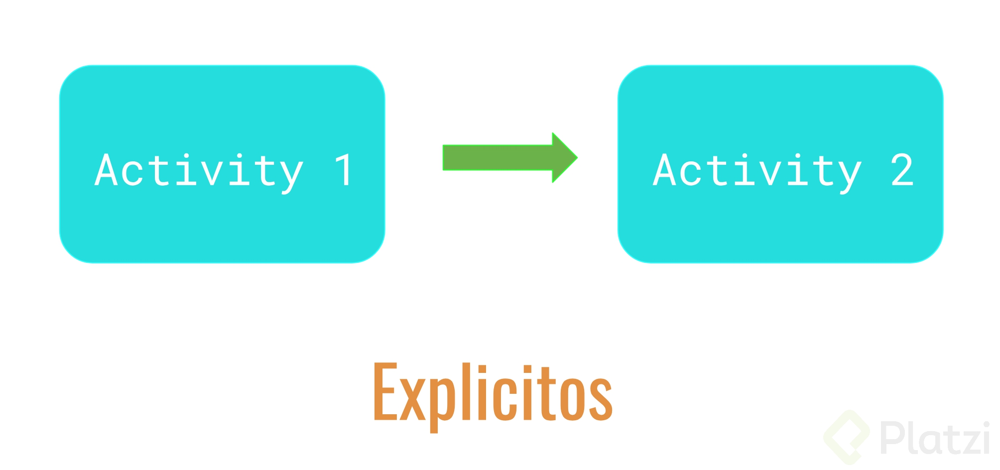
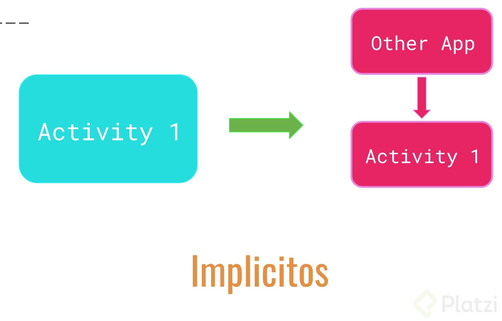
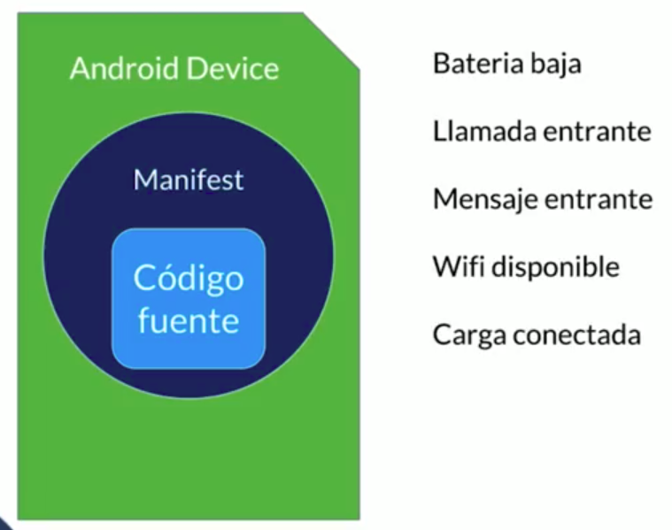
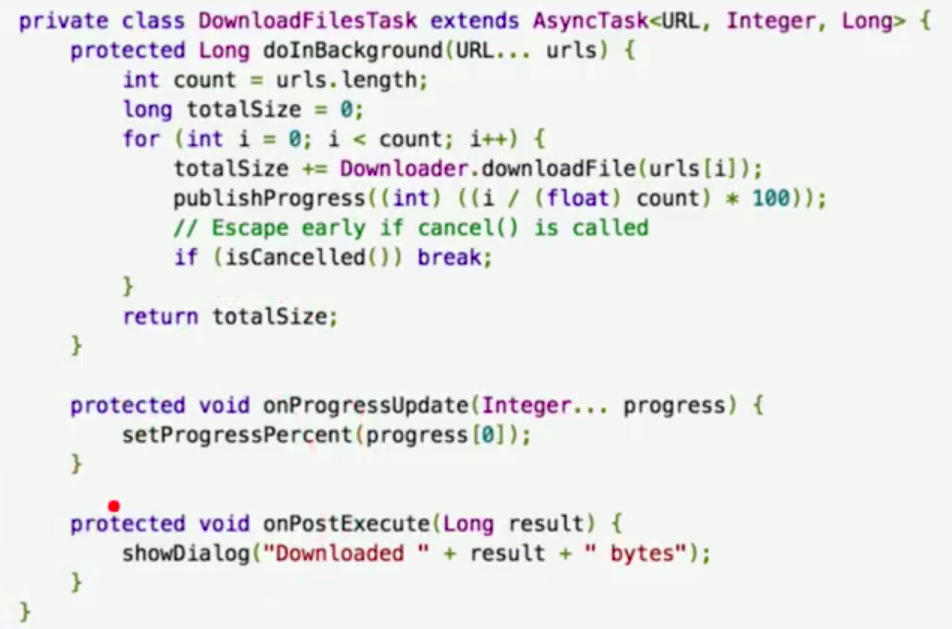
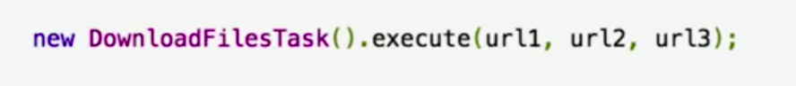

# Notes-Learning-Android-

Challenges of developing Apps
\*Availability

- Performance (Unfortunately, kobo has stopped)
  ----> Quality

1. Know the Operating System
2. The versions of the Operating system (Choose based on% of use)
3. Android Screen Densities
4. Performance (Memory usage and CPU consumption)
5. Design Metrics (Material Design)
6. Development environment
7. Testing

Types of Android devices and Support
     Each android device hardware has an ID to be invoked
     example: FEATURE_CAMERA_FRONT, FEATURE_NFC, FEATURE_SENSOR_STEP_COUNTER, FEATURE_MICROPHONE

    minSdkVersion 15 to be classified in play store
    targetSdkVersion 26 is the target version with which the app is 100% compatible but still compatible with the 28.29

# Componentes de una aplicación

# Activity (Class Java hereda de la clase Activity + XML layaut)

# Cicle life to Activity

- In method create save state of Activity
- onResumen() The activity has become visible
- onPause() "partially Visible" Another activity is taking focus(this activity is about to be "paused")
- onStop() The activity is no longer visible, this happens when you press home
- onDestroy() the activity is destroy

In Spanish
onCreate(Bundle): Se llama en la creación de la actividad. Se utiliza para realizar todo tipo de inicializaciones, como la creación de la interfaz de usuario o la inicialización de estructuras de datos. Puede recibir información de estado de la actividad (en una instancia de la clase Bundle), por si se reanuda desde una actividad que ha sido destruida y vuelta a crear.

onStart(): Nos indica que la actividad está a punto de ser mostrada al usuario.

onResume(): Se llama cuando la actividad va a comenzar a interactuar con el usuario.

onPause(): Indica que la actividad está a punto de ser lanzada a segundo plano, normalmente porque otra actividad es lanzada.

onStop(): La actividad ya no va a ser visible para el usuario.

onRestart(): Indica que la actividad va a volver a ser representada después de haber pasado por onStop().

onDestroy(): Se llama antes de que la actividad sea totalmente destruida. Por ejemplo, cuando el usuario pulsa el botón de volver o cuando se llama al método finish().

# Fragment

Used
-FragmentManager
-Transaction
-Commits

# Intent

In Spanish
Los Intents nos servirán para unir componentes de una aplicación, y podemos tener dos casos específiamente:

1. El que ya mencionamos, unir Activity’s dentro de la aplicación
2. Unir Activity’s que viven en diferentes aplicaciones

Los primeros se llamarán Explicitos

Los segundos Implícitos

# Services

las actividades detonan servicios
Un servicio puede adoptar esencialmente dos formas:

# Servicio iniciado

Un servicio está "iniciado" cuando un componente de aplicación (como una actividad) lo inicia llamando a startService().
Una vez iniciado, un servicio puede ejecutarse en segundo plano de manera indefinida, incluso si se destruye el componente que lo inició. Por lo general, un servicio iniciado realiza una sola operación y no devuelve un resultado al emisor. Por ejemplo, puede descargar o cargar un archivo a través de la red. Cuando la operación está terminada, el servicio debe detenerse por sí mismo.

# Servicio de enlace

Un servicio de enlace ofrece una interfaz cliente-servidor que permite que los componentes interactúen con el servicio, envíen solicitudes, obtengan resultados e incluso lo hagan en distintos procesos con la comunicación entre procesos (IPC).

# Notas

Cualquier componente de la aplicación puede utilizar el servicio (incluso desde otra aplicación)
de la misma forma que cualquier componente puede utilizar una actividad—iniciándola con una Intent. Sin embargo, tú puedes declarar el servicio como privado, en el archivo de manifiesto, y bloquear el acceso de otras aplicaciones.
Ejemplo
<manifest ... >
...
<application ... >
<service android:name=".ExampleService" />
...
</application>
</manifest>

¿Debes utilizar un servicio o un subproceso?

# Un servicio

Es simplemente un componente que puede ejecutarse en segundo plano, incluso cuando el usuario no está interactuando con tu aplicación.

# Un subproceso

Si necesitas realizar un trabajo fuera del subproceso principal, pero solo mientras el usuario interactúa con tu aplicación, Ejemplo, si deseas reproducir música, pero solo mientras se ejecute tu actividad, puedes crear un subproceso en onCreate(), comenzar a ejecutarlo en onStart() y luego detenerlo en onStop().También considera la posibilidad de utilizar AsyncTask o HandlerThread.

# Nota

Si utilizas un servicio, este se ejecuta en el subproceso principal de tu aplicación de forma predeterminada, por lo que debes crear un subproceso nuevo dentro del servicio si este realiza operaciones intensivas o de bloqueo.

#Crear un Servicio
Debes crear una subclase de Service (o una de sus subclases existentes). En tu implementación, debes reemplazar algunos métodos callback que manejan aspectos fundamentales del ciclo de vida del servicio y proporcionar un mecanismo para que los componentes se enlacen con el servicio, si corresponde. Los métodos callback más importantes que debes reemplazar son los siguientes:

Documentation
https://developer.android.com/guide/components/services?hl=es

#BroadCast Receivers (Receptores de transmisores)
Siempre estan al pendiente de lo que pase en el Sistema Operativo

Manifest: Se encargara de tener todo declarado respecto lo que pase en el dispositivo movil, es que el tiene contacto con el hardware. Estarán definidos aquí los Broadcast, porque estarán a alerta a lo que pase a las señales que envié el hardware para saber como operar, que aplicaciones utilizar, tomar decisiones.

#Asynctask
Execute in Background
Example

Example execute AsyncTask

# Desarrollo

# Gradle

Es utilizado por Android Studio para ++construir ++aplicaciones.
Toma el código, las dependencias y librerías externas; las reune y construye un archivo ejecutable (APK: Application Package). -** Realiza lo siguiente**:
1.- Integrar dependencias.
2.- Crear un sistema de archivos.
3.- Genera un ejecutable (APK).
Está basado en el lenguaje de programación** Groovy**, utiliza el Domain Specified Languaje (Lenguaje de dominio especificado).
Tiene como archivo principal de configuración:** build.gradle**

# Google Play Services

